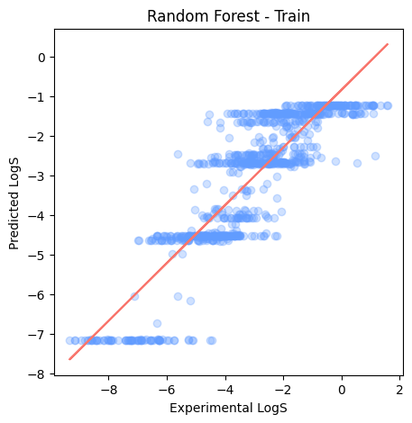
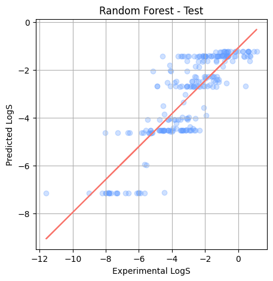

# Solubility Prediction with Machine Learning 

## Overview
This project predicts molecular solubility (logS) using the Delaney dataset, which contains solubility measurements and molecular descriptors. Three machine learning models were trained and evaluated:

- Linear Regression
- Random Forest
- XGBoost

## Dataset
The dataset is sourced from the [Delaney solubility dataset](https://raw.githubusercontent.com/dataprofessor/data/master/delaney_solubility_with_descriptors.csv).

- **Features**: MolLogP, MolWt, NumRotatableBonds, AromaticProportion
- **Target**: logS (logarithm of solubility)

## Model Performance

| Method           | Train MSE | Train R² | Test MSE | Test R² |
|------------------|-----------|----------|----------|---------|
| Linear Regression| 1.0075    | 0.7645   | 1.0207   | 0.7892  |
| Random Forest    | 1.0282    | 0.7597   | 1.4077   | 0.7092  |
| XGBoost          | **0.0281**| **0.9934**| **0.7456**| **0.8460** ✅ |

**Selected Model**: XGBoost performed best, with the highest test R² and lowest test MSE, indicating strong generalization to unseen data.

## Visualizations

| Model             | Training Plot                                      |
|------------------|-----------------------------------------------------|
| Linear Regression |  |
| Random Forest     |          |
| XGBoost           |               |


### Test Set Plots
| Model             | Plot |
|------------------|------|
| Linear Regression |    |
| Random Forest     |            |
| XGBoost           |                 |


---

## Installation

```bash
# Clone the repository
git clone https://github.com/yourusername/solubility-prediction.git
cd solubility-prediction

# Install dependencies
pip install -r requirements.txt

```

## Project Structure

```bash
solubility-prediction/
├── ML_project_for_Solubility_Prediction.ipynb
├── README.md
├── dataset/
│   └── delaney_solubility_with_descriptors.csv
├── images/
│   ├── linear_regression_train_plot.png
│   ├── linear_regression_test_plot.png
│   ├── random_forest_train_plot.png
│   ├── random_forest_test_plot.png
│   ├── xgboost_train_plot.png
│   └── xgboost_test_plot.png
└── requirements.txt
```


## Future Improvements
- Add cross-validation to improve model robustness  
- Tune XGBoost hyperparameters (`max_depth`, `learning_rate`, etc.)  
- Add an interactive dashboard or Streamlit app  
- Explore feature importance and SHAP values for model interpretability  

## Contact
For questions or feedback, feel free to open an issue or contact me via GitHub or email hamalibulut1[at]gmail[dot]com.
